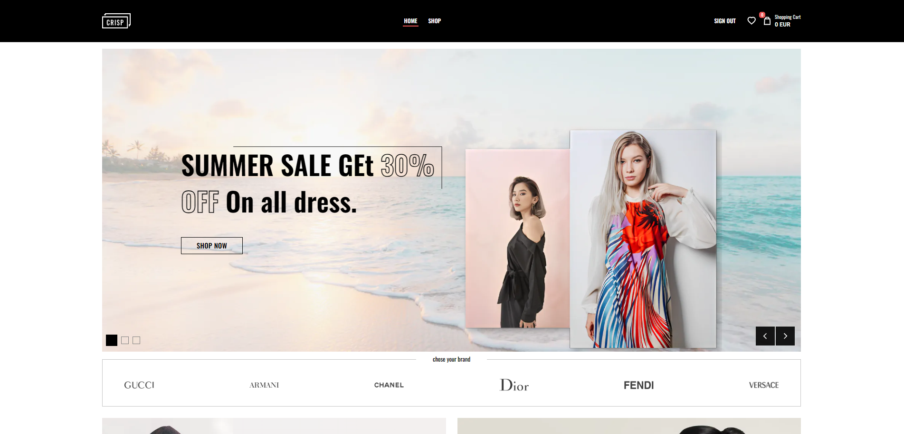
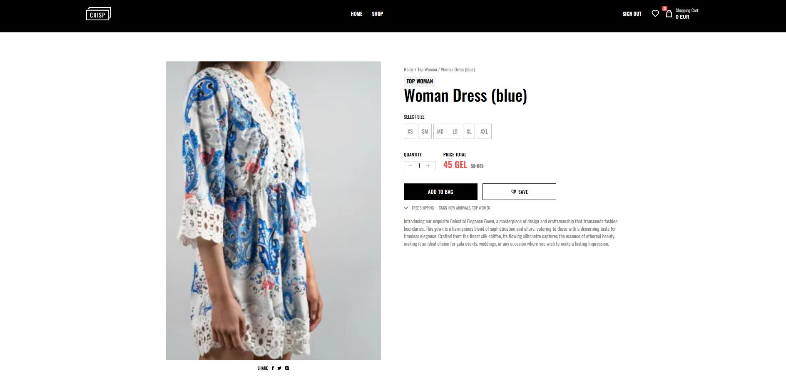
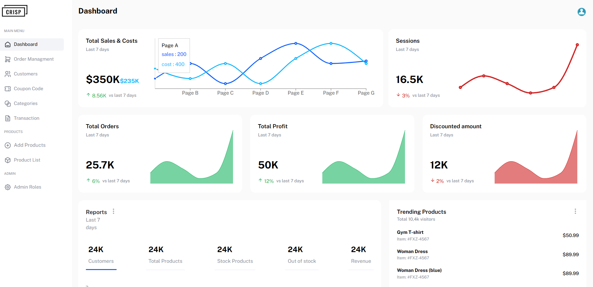

# CRISP E-commerce Website

## Overview

Welcome to CRISP, an open-source e-commerce website designed to provide a clean, responsive, and user-friendly online shopping experience. This project is hosted on GitHub to encourage collaboration and contributions from the community.

### Features

- ✅ **User-friendly Interface:** CRISP offers an intuitive and aesthetically pleasing interface for a seamless shopping experience.
- ✅ **Responsive Design:** The website is designed to work on various devices, ensuring a consistent experience on desktops, tablets, and mobile phones.
- ✅ **Product Management:** Easily add, update, and manage products with a straightforward admin interface.
- ✅ **Shopping Cart:** Users can add products to their cart and proceed to checkout with a secure and efficient shopping cart system.
- ✅ **Authentication:** Secure user authentication and authorization mechanisms for customer accounts and admin access.
- ✅ **Order Management:** Track and manage orders efficiently, providing users with order history and status updates.
- ✅ **Admin Dashboard:** Update products, add products, manage users and track sales

## **User-friendly Interface:** 


## **Single product page:** 


## **Admin dashboard:** 



## Getting Started

Follow these steps to get the CRISP e-commerce website up and running on your local machine.

### Prerequisites

1. Node.js and npm installed
2. Git installed

### Installation
Clone the repository:

```terminal
git clone https://github.com/your-username/crisp-ecommerce.git
```

Navigate to the project directory:

```terminal
cd euphoria-ecommerce
```

Install dependencies:

```terminal
npm install
```

Set up environment variables:

Create a .env file in the root directory.

Define the following variables:

```env
PAYPAL_CLIENT_ID = ""
PAYPAL_CLIENT_SECRET = ""
NEXT_PUBLIC_PAYPAL_CLIENT_ID = ""
NEXT_PUBLIC_DATABASE_URL = ""


JWT_SECRET=""

NEXT_PUBLIC_SERVER_URL=""

NEXT_PUBLIC_CLOUDINARY_CLOUD_NAME=""
NEXT_PUBLIC_CLOUDINARY_UPLOAD_PRESET=""

NEXT_PUBLIC_EMAIL = ""
NEXT_PUBLIC_EMAIL_PASS = "
```

Start the development server:
```terminal
npm run dev
```

Open your browser and visit http://localhost:3000 to access CRISP.

Contributing
We welcome contributions from the community! If you'd like to contribute to CRISP, please follow our Contribution Guidelines.

License
CRISP is released under the MIT License. Feel free to use, modify, and distribute it according to your needs.

Support
For any issues or questions, please create an issue.

Happy shopping with CRISP!
